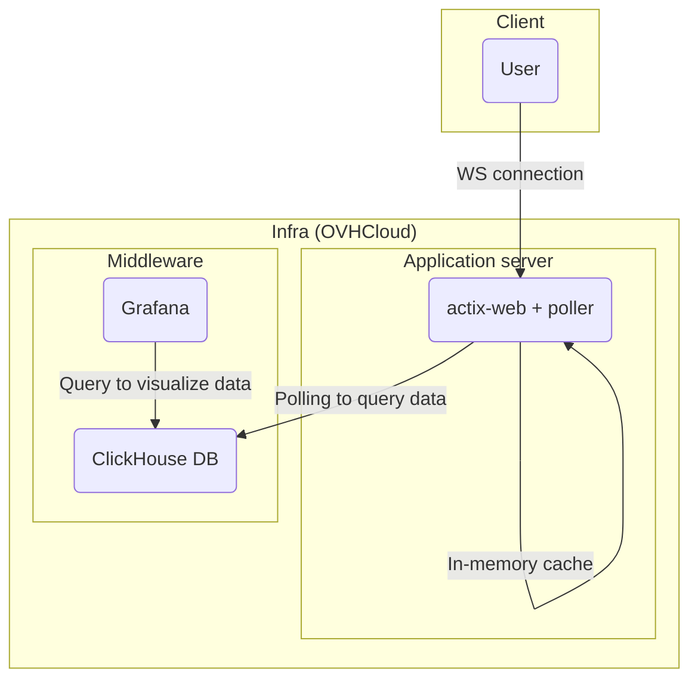

# Simple websocket k6 load test
## How it works
- Websocket server (actix-web) sends random data of fixed size (`DATA_SIZE`) whenever 1s.
- Client (k6) accepts this binary data
## Test results
### Environment
Macbook Pro "14 (2023, M2 Max)
### List
| size | throughput | link |
| - | --- | --- |
| 1M  | 100MB/s  | [here](./results/1M.txt) |
## Structure
